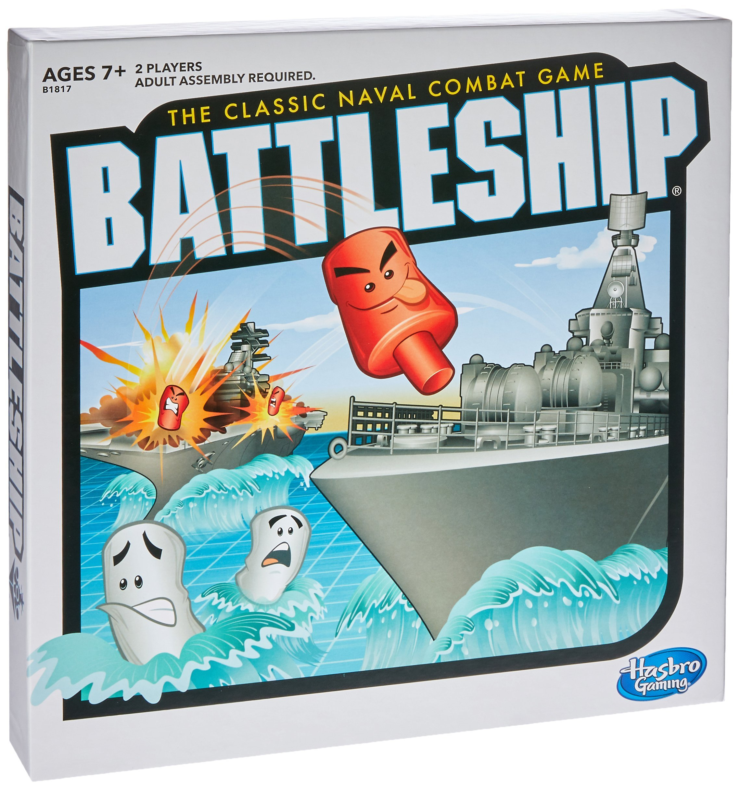
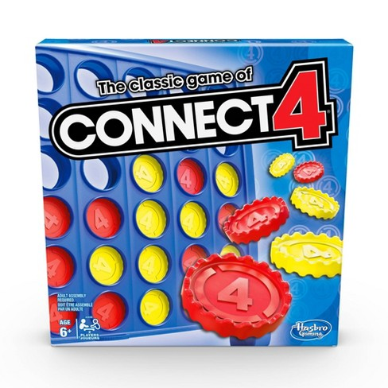

Portfolio
=========

Programming Projects
--------------------

*For access to my private project repositories, please [email me](mailto:mkgaudraul@csustudent.net?subject=GitHub%20Access) with the subject line, GitHub Access.

---
### [BattleShip with AI | CSCI 235](project1)

---
### [ConnectFour | CSCI 125](project2)

---

Ethics Papers
-------------

### [From High School Drop Out To International Man of Myster](/pdf/GaudraultWhitePaper1.pdf)

-   **Class: CSCI 405 Principles of Cybersecurity**  
-   **Grade:95**
-   
### [Behind Every Great Computer There is a User](/pdf/GaudraultWhitePaper2.pdf)

-   **Class: CSCI 405 Principles of Cybersecurity**  
-   **Grade:**
---

Presentations
-------------

### [Coastal Birth Services Schedule App](/pdf/Group1_Assignment7.pdf)

- **Class:CPT 264 Systems and Procedures** 
- **Grade: A**

### [How a Life Saving Device Could Have Been Deadly](https://youtu.be/XXF_KphNsuA)

- **Class:CSCI 301 Survey of Scripting Language** 
- **Grade: A**

---

Page template forked from <a href="https://github.com/csu-cs/csci-portfolio">CSU-CS</a>

<!-- Remove above link if you don't want to attributive -->
