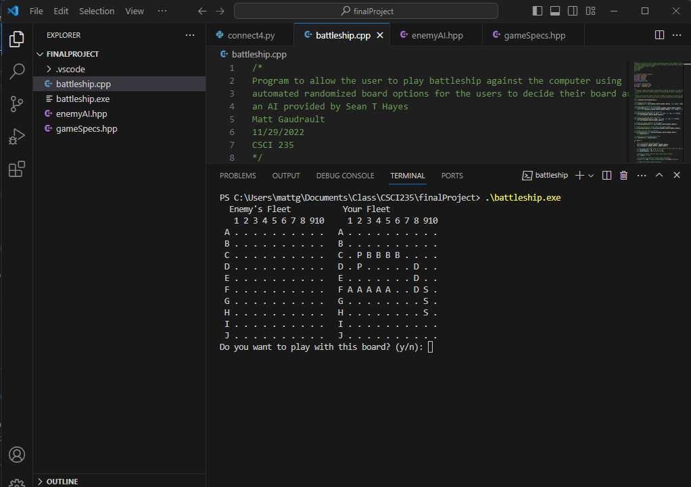
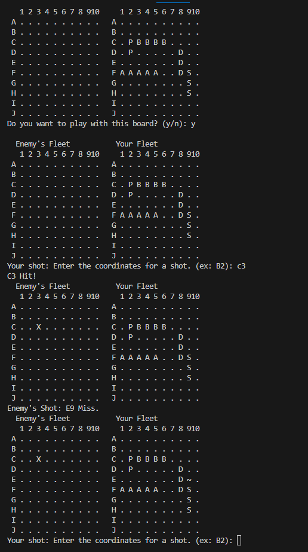
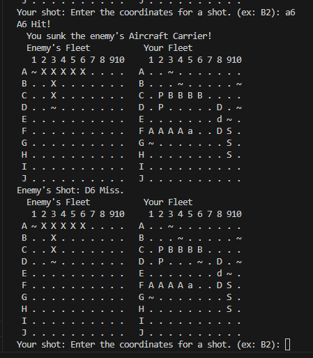
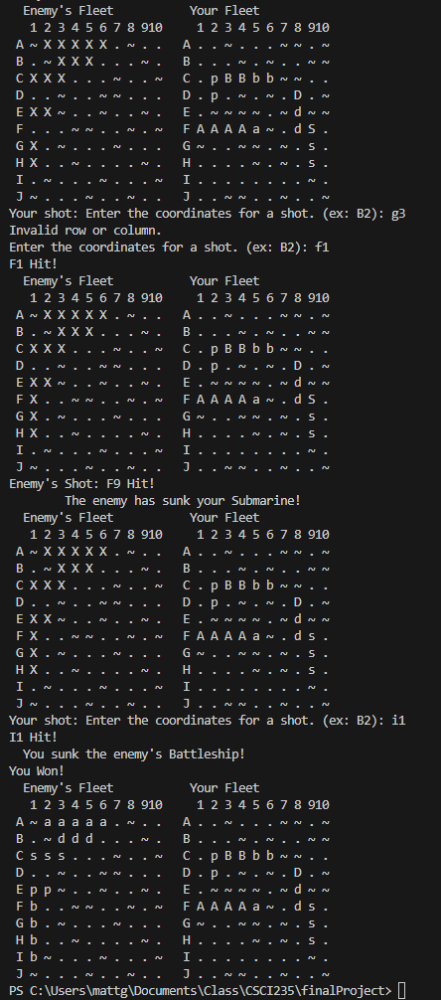

[Back to Portfolio](./)

BattleShip with AI
===============

-   **Class:CSCI 235** 
-   **Grade:A** 
-   **Language(s): C++** 
-   **Source Code Repository:** [mgaudrault/battleship](https://github.com/mgaudrault/battleship)  
    (Please [email me](mailto:mkgaudrault@csustudent.net?subject=GitHub%20Access) to request access.)

## Project description

Recreated the Kids Game as a computer game with Artificial Intellegence enemy.  The AI aspect of the game was created by Sean Hayes and was included with the class work.  

## How to compile and run the program

How to compile (if applicable) and run the project. You will need a C++ compiler, I used G++ and downloaded MinGW-x64. My work was done through Virtual Studios so I have included the steps used to make sure you can run the code below.
[Click Here for steps to update Virtual Studio for C++](https://code.visualstudio.com/docs/languages/cpp)

```bash
cd ./project
.\battleship.exe
```


## UI Design

As the focus on this class was to get the programming steps correct, the UI is pretty simple and is all in the terminal itself.  When you start the game you will see both the opponents board (all blank as you wouldn't see their configuration) and your player board with a question asking if this is the board you would like to play with.  The user would then put either "y" or "n" depending on if they like the lay out of the ships on the right hand side.  The ships are visible via letters on the board with the names aligning as below
Aircraft Carrier 5 spaces long marked with letter A
Battleship       4 spaces long marked with letter B
Destroyer        3 spaces long marked with letter D
Submarine        3 spaces long marked with letter S
Patrol Boat      2 spaces long marked with letter P
See Figure 1

You then take turns back and forth with the AI/Computer enemy with hits being marked with "X" and misses marked with "~" see figure 2. When the opponent hits one of your ships the capital letter changes to lower case. After you take out one of the enemy's ships you are notified which one you sank. see figure 3. When the user inputs either a space that has already been used or something incorrectly the message "Invalid row or column." is shown and you are asked to enter your coordinate for a shot again. Once you have sunk the last ship you are told that you have won the game and then the session is ended. see figure 4


  
Fig 1. The launch screen

  
Fig 2. Example output after input is processed.

  
Fig 3. When you sink an enemy ship.

  
Fig 4. When the game ends.

## 3. Additional Considerations

This is a fun example of how a complex idea like playing battleship with the computer can be implemented with a logical approach.  This was a fun project for me as it was something I could show my wife and she could play.

[Back to Portfolio](./)
