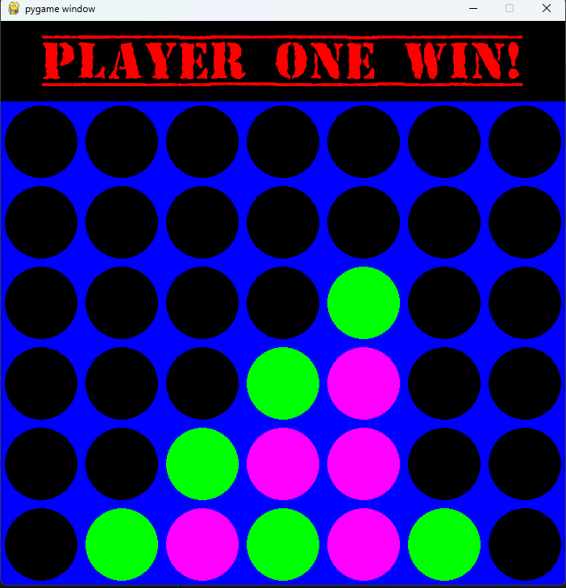

[Back to Portfolio](./)

Group1 Connect4
===============

-   **Class: Intro to Computer Science at University of South Carolina** 
-   **Grade: A** 
-   **Language(s): python** 
-   **Source Code Repository:** [mgaudrault/connect4](https://github.com/mgaudrault/connect4)  
    (Please [email me](mailto:mkgaudrault@csustudent.net?subject=GitHub%20Access) to request access.)

## Project description

In this class we had to work together as a group of 4 students to decide what project we were going to do and then implement that plan.  In my group we had a couple ideas we were planning but ended up going with the idea of creating a computerized connect4 game with a vizual user interface that interacted with the mouse movements and clicks of the user.  We researched the idea online and then were able to share the coding work amongst the group.  This not only showed teamwork and the ability to write python scripts but also gave real world experience as it is very common to work on the a shared project in the work place. 

## How to compile and run the program

Since we made this game have a colorful UI, you will most likely need to install a couple python addons. numpy and pygame. While in terminal run the commands listed below

```bash
pip install numpy
pip install pygame
cd ./project
python connect4.py
```

## UI Design

We wanted this game to be visually nice so we were able to create a UI that would open a new window to work as the game board.  The mouse controls the placement of the different color chips. In Figure 1 you can see the board and the first users game piece which is a bright green.  After the user clicks the column they want it to drop to the player piece is then moved to the lowest available spot and it is the next users turn with their magenta game piece.  The turns continue alternating (see figure 2) until there are 4 game pieces of the same color in a row and the game is over.  The top of the board will then read who is the winner, either player 1 or player 2.  After a few seconds delay the board will then close itself.

  
Fig 1. The launch screen

  
Fig 2. Example of player 2's turn.

  
Fig 3. Completion of the game and winner annoucement.

## 3. Additional Considerations

This game was challenging to make as there was some very indepth python programming and we had to work as a team. This was a little difficult as we had figure out how to have everyone able to complete the steps they were assigned with the different levels of coding backgrounds.


[Back to Portfolio](./)